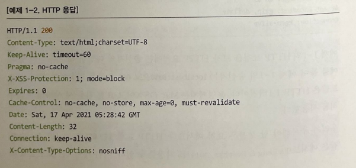

# 1.1 TODO 웹 애플리케이션

## 1.1.1 Todo 웹 애플리케이션 기능

- Todo 생성: + 버튼을 클릭해 Todo 아이템을 생성할 수 있다
- Todo 리스트: 생성된 아이템 목록을 화면에서 확인할 수 있다
- Todo 수정: Todo 아이템을 체크하거나 내용을 수정할 수 있다
- Todo 삭제: Todo 아이템을 삭제할 수 있다
- 회원가입: 사용자는 애플리케이션에 회원가입하고 생성된 계정을 이용해 Todo 애플리케이션에 접근할 수 있다
- 로그인: 계정을 생성한 사용자는 계정으로 로그인할 수 있다
- 로그아웃: 로그인한 사용자는 로그아웃할 수 있다.

## 1.1.2 Todo 웹 애플리케이션 아키텍처

## 1.2 배경 지식

### 1.2.1 하이퍼텍스트 트랜스퍼 프로토콜

HTTP 는 애플리케이션 레벨의 네트워크 프로토콜이다. 즉, 다른 문서로 향하는 링크가 있는 텍스트의 통신 규약이다.

그러나 오늘날의 HTTP는 HTML 문서를 주고받던 간단한 프로토콜에서 벗어나 그림 파일, 동영상, 3D 등 다양한 미디어 리소스를 
주고 받는 형태로 발전했다.

사용자는 브라우저라는 클라이언트를 통해 서버에 HTTP 요청을 전송할 수 있으며, 브라우저의 주소창에 URL 을 입력하고 엔터를 누르면
브라우저는 HTTP GET 요청을 해당 URL 서버로 전송하고 그 결과인 HTTP 응답을 브라우저에 렌더링한다.

 

- HTTP 요청

HTTP 요청에는 송신자의 다양한 정보가 담겨있다.
그림에서 송신자는 localhost:8080 으로 GET 요청을 전송하려 하였고, 프로토콜은 HTTP 1.1 버전, 운영체제는 Mac OS X 이며,
요청 전송 시 사파리 브라우저를 사용했다.

주목해야 할 부분은 요청 메서드인데, HTTP 요청에는 GET, POST, PUT, DELETE 와 같은 메서드를 지정할 수 있다.
요청 메서드는 호스트에 지정한 리소스에 어떤 작업을 하고 싶은지 알려주는 역할을 한다.

| 메서드 | 기능            |
|:----|:--------------|
| GET | 리소스를 가져올 때 사용 |
|POST|리소스에 대해 임의의 작업 (생성, 수정)을 할 때 사용|
|PUT|리소스를 대체할 때 사용|
|DELETE|리소스를 삭제할 때 사용|

> 웹에서의 리소스: HTTP 요청 대상을 리소스라고 부름 (문서, 사진, 텍스트, 동영상 어떤 것이든 될 수 있음)

 

- HTTP 응답

HTTP/1.1 옆 200 이라는 숫자는 응답 코드이다. 응답 코드를 통해 사용자의 요청이 어떻게 처리되었는지 알 수 있다.

|응답코드|설명|
|:---|:---|
|200|성공적으로 요청을 처리함|
|404|해당 리소스가 존재하지 않음|
|403|송신자에게 해당 리소스에 접근할 권한이 없음|
|500|서버의 에러로 요청을 처리할 수 없음|

Content-Type 은 응답 미디어 타입을 의미한다. 미디어 타입에는 text/html, text/css, application/json, video/mpeg 등이 있다.
이외에도 Keep-Alive, Cache-Control, Connection 등 통신에 관련된 정보를 확인할 수 있다.

마지막으로 응답 body 가 있다. 서버 애플리케이션은 보통 HTTP 응답 바디에 요청 처리 결과를 보낸다. 예를 들어 www.google.com 에 GET 요청을
보내면 GOOGLE 의 랜딩 페이지 HTML을 넣어 반환한다.

