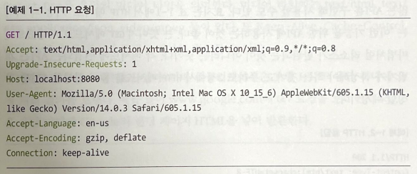

# 1.1 TODO 웹 애플리케이션

## 1.1.1 Todo 웹 애플리케이션 기능

- Todo 생성: + 버튼을 클릭해 Todo 아이템을 생성할 수 있다
- Todo 리스트: 생성된 아이템 목록을 화면에서 확인할 수 있다
- Todo 수정: Todo 아이템을 체크하거나 내용을 수정할 수 있다
- Todo 삭제: Todo 아이템을 삭제할 수 있다
- 회원가입: 사용자는 애플리케이션에 회원가입하고 생성된 계정을 이용해 Todo 애플리케이션에 접근할 수 있다
- 로그인: 계정을 생성한 사용자는 계정으로 로그인할 수 있다
- 로그아웃: 로그인한 사용자는 로그아웃할 수 있다.


## 1.1.2 Todo 웹 애플리케이션 아키텍처


<br/>

## 1.2 배경 지식

### 1.2.1 하이퍼텍스트 트랜스퍼 프로토콜

HTTP 는 애플리케이션 레벨의 네트워크 프로토콜이다. 즉, 다른 문서로 향하는 링크가 있는 텍스트의 통신 규약이다.


그러나 오늘날의 HTTP는 HTML 문서를 주고받던 간단한 프로토콜에서 벗어나 그림 파일, 동영상, 3D 등 다양한 미디어 리소스를 
주고 받는 형태로 발전했다.


사용자는 브라우저라는 클라이언트를 통해 서버에 HTTP 요청을 전송할 수 있으며, 브라우저의 주소창에 URL 을 입력하고 엔터를 누르면
브라우저는 HTTP GET 요청을 해당 URL 서버로 전송하고 그 결과인 HTTP 응답을 브라우저에 렌더링한다.

<br/>

- HTTP 요청



HTTP 요청에는 송신자의 다양한 정보가 담겨있다.
그림에서 송신자는 localhost:8080 으로 GET 요청을 전송하려 하였고, 프로토콜은 HTTP 1.1 버전, 운영체제는 Mac OS X 이며,
요청 전송 시 사파리 브라우저를 사용했다.

주목해야 할 부분은 요청 메서드인데, HTTP 요청에는 GET, POST, PUT, DELETE 와 같은 메서드를 지정할 수 있다.
요청 메서드는 호스트에 지정한 리소스에 어떤 작업을 하고 싶은지 알려주는 역할을 한다.

| 메서드 | 기능            |
|:----|:--------------|
| GET | 리소스를 가져올 때 사용 |
|POST|리소스에 대해 임의의 작업 (생성, 수정)을 할 때 사용|
|PUT|리소스를 대체할 때 사용|
|DELETE|리소스를 삭제할 때 사용|

> 웹에서의 리소스: HTTP 요청 대상을 리소스라고 부름 (문서, 사진, 텍스트, 동영상 어떤 것이든 될 수 있음)

<br/>

- HTTP 응답


HTTP/1.1 옆 200 이라는 숫자는 응답 코드이다. 응답 코드를 통해 사용자의 요청이 어떻게 처리되었는지 알 수 있다.

|응답코드|설명|
|:---|:---|
|200|성공적으로 요청을 처리함|
|404|해당 리소스가 존재하지 않음|
|403|송신자에게 해당 리소스에 접근할 권한이 없음|
|500|서버의 에러로 요청을 처리할 수 없음|

Content-Type 은 응답 미디어 타입을 의미한다. 미디어 타입에는 text/html, text/css, application/json, video/mpeg 등이 있다.
이외에도 Keep-Alive, Cache-Control, Connection 등 통신에 관련된 정보를 확인할 수 있다.

마지막으로 응답 body 가 있다. 서버 애플리케이션은 보통 HTTP 응답 바디에 요청 처리 결과를 보낸다. 예를 들어 www.google.com 에 GET 요청을
보내면 GOOGLE 의 랜딩 페이지 HTML을 넣어 반환한다.


<br/>

### 1.2.2 자바스크립트 오브젝트 노테이션

JSON (JavaScript Object Notation) 은 '오브젝트'를 표현하는 문자열이다.

> - Object란?
> 오브젝트란 메모리상에 존재하는 어떤 자료 구조이다.
> 
> 
> 
> 


그림처림 애플리케이션 1은 애플리케이션 2에 인터넷을 통해 TodoItem 을 전송하려 한다. 애플리케이션 1과 애플리케이션 2는 서로
언어도 다르고 아키텍처도 다르다고 가정하면, 이 오브젝트를 전송하기 위해선 애플리케이션 1과 애플리케이션 2 둘 다 이해할 수 있는 형태로
오프벡트를 변환해야 한다. 이렇게 저장 또는 전송을 위해 메모리상의 오브젝트를 다른 형태로 변환하는 작업을 직렬화 (Serialization) 라고 하고
그 반대 작업을 역직렬화 (Deserialization) 라고 한다.

그러면 어떤 형태로 오브젝트를 직렬화할 것인가에 대한 질문이 남는데 JSON 이다.

JSON은 키-값 (Key-value)의 형태로 오브젝트를 표현한 문자열이다.


그림은 TodoItem 오브젝트를 JSON 으로 변환한 예인데, 자바 인스턴스 변수의 이름은 key 가 되고 변수에 들어간 값은 value 가 되는 것을 확인할 수 있다.


위에서 확인할 수 있듯 JSON (Javascript Object Notaion)은 형식이 자바스크립트에서 오브젝트를 생성하는 형식과 같아서 JSON 이라고 
부른다.


<br/>

다시 애플리케이션 1과 애플리케이션 2의 상황으로 돌아가서 애플리케이션 1과 애플리케이션 2는 JSON 을 이용해 통신하기로 약속했다고 가정하자


그림처럼 오브젝트를 JSON 형태의 문자열로 변환한 후 HTTP 요청의 바디 부분에 변환한 JSON 을 넣어 요청을 전송한다.
요청을 받은 애플리케이션 2는 HTTP 요청의 바디 부분에서 JSON 을 꺼내 TodoItem 으로 변환해 사용할 수 있다.


정리해보면 브라우저상에서 실행될 리액트 애플리케이션은 JSON 을 요청 바디에 넣어 보낸다. 그러면 자바 백엔드 애플리케이션은 이 JSON 을
바디에서 꺼내 TodoItem 으로 변환한다. 물론 이러한 변환 과정은 라이브러리와 프레임워크가 대신 해주므로 크게 신경 쓸 일은 없다.

<br/>

### 1.2.3 서버란?

서버란 프로그램인데 특정 포트, 예를 들어 8080 포트에 소켓을 열고 클라이언트가 연결할 때까지 무한 대기하며 기다린다. 긜고 클라이언트가 연결하면
해당 클라이언트 소켓에서 요청을 받아와 수행하고 응답을 작성해 전달한다.


- 아주 간단한 서버 예

```java
import java.net.ServerSocket;
import java.net.Socket;

public class WebServer {

    public static void main(String[] args) {
        new WebServer().run();
    }

    public void run() {
        try {
            ServerSocket serverSocket = new ServerSocket(8080);
            while (true) {
                try {
                    Socket client = serverSocket.accept();
                    new Thread(() -> handleClient(client)).start();
                } catch (Exception e) {
                    e.printStackTrace();
                }
            }
        } catch (Exception e) {
            e.printStackTrace();
        }
    }
    
    private static void handleClient(Socket client) {
        // (1) 클라이언트의 요청 읽어오기
        // (2) 클라이언트의 요청에 맞는 작업 수행하기
        // (3) 클라이언트에게 응답 작성하기
        // (4) 소켓 닫기
    }
}
```

예시처럼 아주 간단한 서버에서 클라이언트에게 요청을 읽어올 때 또는 응답을 작성할 때 FTP (File Transfer Protocol) 을 사용한다면 FTP 서버가 되는 것이고,
하이퍼텍스트 트랜스퍼 프로토콜을 사용한다면 HTTP 서버가 되는 것이다. 어찌되었건 서버는 네트워크 오퍼레이션을 수행하는 프로그램이다.

<br/>

### 1.2.4 정적 웹 서버

정적 웹 서버 (Static Web Server) 란 HTTP 서버 중에서도 리소스 파일을 리턴하는 서버를 의미한다.


예를 들어 서버 호스트는 8080 에서 실행되고 있는 로컬 호스트라고 가정하면 localhost:8080/file.html HTTP 요청을 서버로 보내면 정적 웹 서버인 이 서버는
지정된 디렉토리 경로에서 file.html 을 찾아 그 내용을 HTTP 응답 바디에 넣어 전송한다. 이때 서버는 해당 html 파일에 아무 작업도 하지 않고 파일 있는 그대로를 리턴하기 때문에
정적 (Static) 웹 서버라고 한다. 정적 웹 서버의 예로는 아파치나 Nginx 등이 있다. 아파치나 Nginx 를 설치하고 지정된 경로에 원하는 리소스 파일을 저장하면 자동으로 해당 리소스는 웹 서버를 통해 접근할 수 있게 된다.
따라서 서버를 설치하고 설정하고 원하는 리소스를 경로에 지정하는 것 말고는 개발자가 할 일은 없다.

<br/>

### 1.2.5 동적 웹 서버

동적 웹 서버 (Dynamic Web Server)는 파일을 있는 그대로 리턴하지 않는다. 동적 웹 서버는 요청을 처리한 후 결과에 따라 응답 바디를 재구성하거나 HTML 템플릿 파일에 결과를 대체해 보낸다.


클라이언트는 요청에 요청 매개 변수를 보낼 수 있다. 예시에선 name=Engineer 라는 매개변수와 값을 보낸다. 이를 확인한 서버는 요청과 매개변수에 맞는 작업을 수행한 후 그 자리에서 
html 파일을 구성하거나 템플릿 html 파일에서 적절한 값을 대체하는 방식으로 html을 구성해 리턴한다. 따라서 동적 웹 서버는 클라이언트가 누군지, 어떤 매개변수를 보내는지에 따라 같은 요청이라도 다른 응답을 받을 수 있다.
이를 위해선 백엔드 개발자들은 소켓 프로그래밍, HTTP 파싱, 스레드 풀 관리 등의 작업을 하여야 하는데 다행히 자바 프로그램 중 서블릿 엔진을 사용하면 동적 웹 서버를 구현할 수 있다.
아파치 톰캣이 서블릿 엔진에 해당한다.


<br/>

### 1.2.6 자바 서블릿 컨테이너/엔진

서블릿 컨테이너 또는 서블릿 엔진은 서버 프로그램이다. 개발자들은 서블릿 엔진을 설치한 후 서블릿 엔진에게 자기가 개발한 비즈니스 로직, 즉 클래스 파일과 해당 클래스 파일 어느 요청에서 실행해야 하는지 알려줘야 한다.
이때 우리는 서블릿 엔진이 이해할 수 있는 형태로 클래스 파일을 작성해야 한다.


서블릿 엔진이 이해할 수 있는 클래스란 javax.servlet.http.HttpServlet 을 상속받는 서브 클래스를 의미한다. 우리는 HttpServlet 을 상속받는 클래스를 작성해 특정 형식에 맞춰 압축해 전달하며,
이를 통해 개발자는 서버를 처음부터 구현하지 않고도 각기 다른 비즈니스 로직을 구현하고 배포할 수 있다.

사용하게될 스프링 부트도 내부적으론 서블릿 엔진의 사용을 위해 서블릿을 상속 및 구현한다. 


